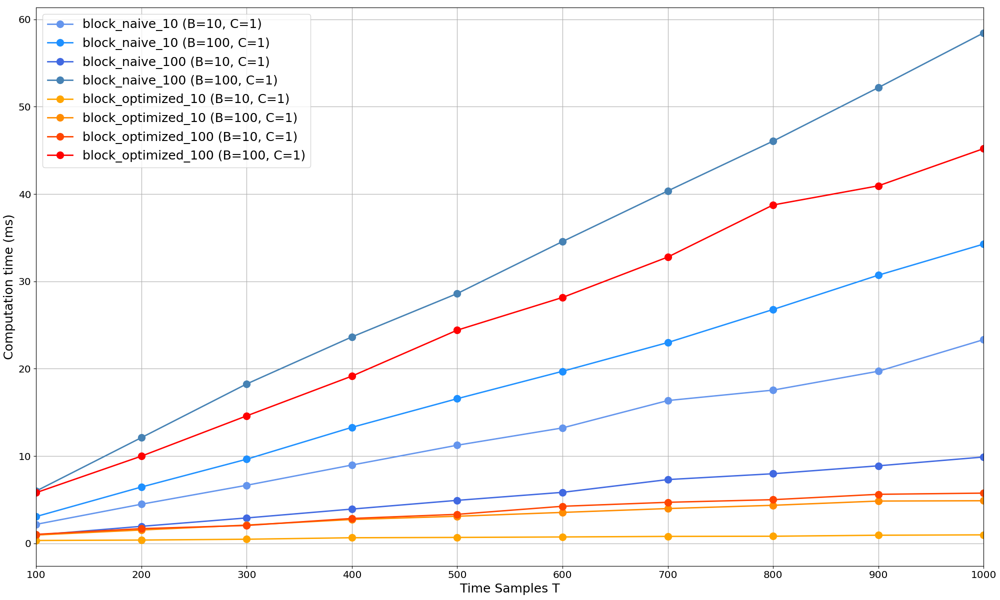
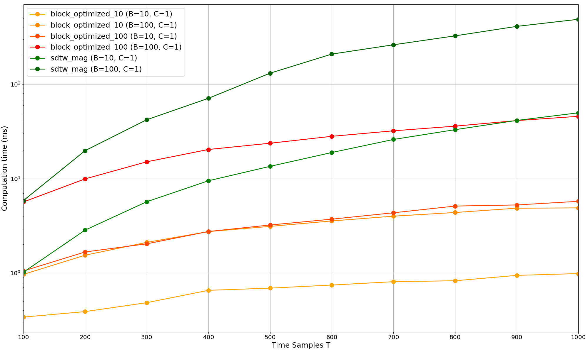
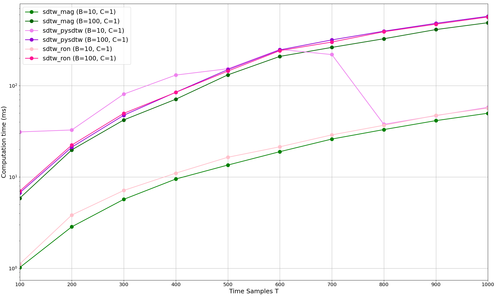

# Benchmark

Examples of scripts to run benchmarks between the various loss functions.
For each comparison there is a `compute` script, to perform calculations and save the results, and a `plot` script to plot the results.

- `block_optimized_vs_naive` : compare the computation time of the optimized version of blockDTW against the naive version.
- `sdtw_vs_block` : compare the computation time of SoftDTW against blockDTW.
- `sdtw_implementations` : compare the various SoftDTW implementations

## Benchmark Example

Below are the results of those benchmarks obtained on my current configuration. A MacBook Pro with an M4 PRO Processor and 24GB of RAM.

Each script measures the time to calculate the loss functions for given values of sample time (T), batch size (B) and number of channels (C).
For clarity of presentation only a subset of the results has been plotted. The plots show the computation time (in milliseconds) against the signal length T. 

### BlockDTW Optimized vs Naive

### SoftDTW VS BlockDTW

### SDTW Implementations

